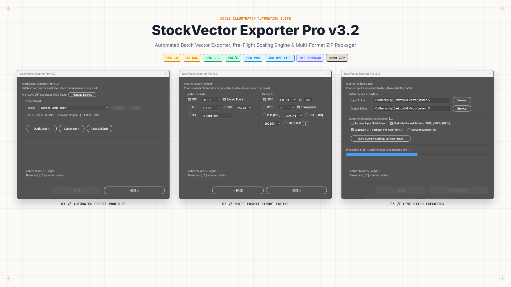
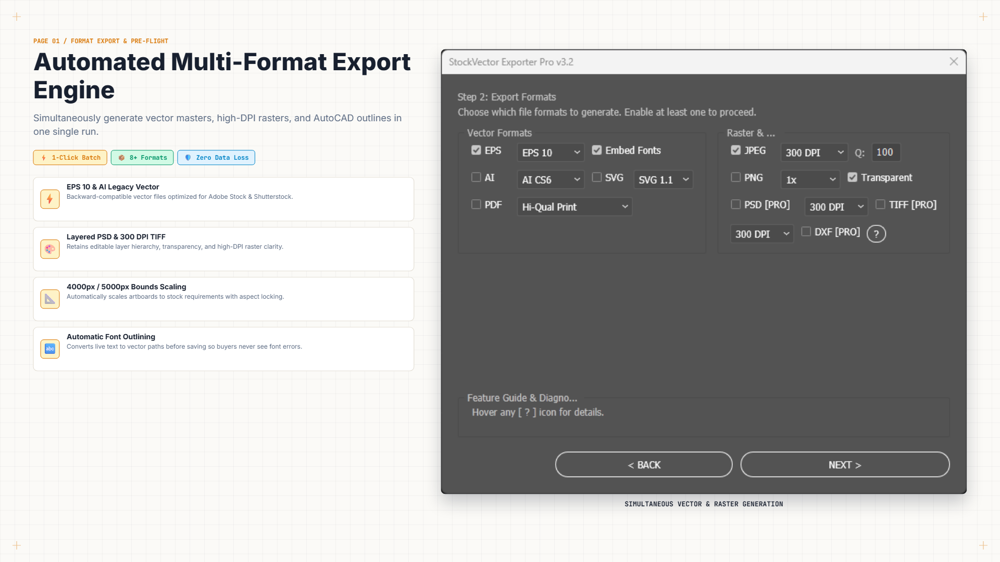
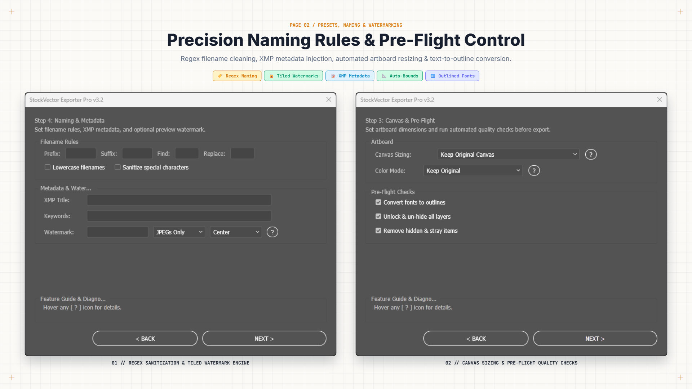
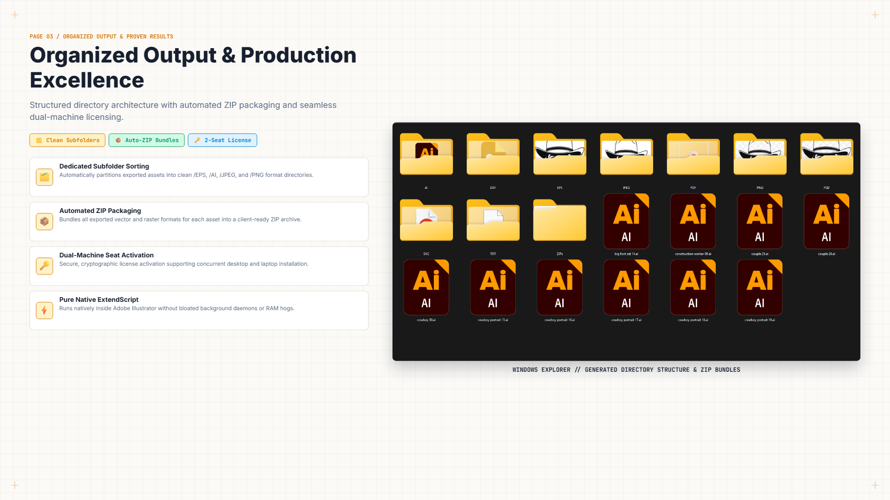

# StockVector Exporter Pro

**Industrial-grade batch vector exporter, stock pre-flight engine, and multi-format ZIP packaging workstation for Adobe Illustrator.** Built for commercial microstock contributors who export and QA hundreds of vectors a day.

[](https://nil4gh.github.io/nildevscripts/)
[](https://niloydev0.gumroad.com/l/StockVectorExporterPro-AdobeIllustrator)
[]()
[]()

---

## What it does

StockVector Exporter Pro is a pure **Adobe ExtendScript (.jsx)** tool — no external binaries, no installers, drop it in and run. It turns the repetitive open → export → package → close loop into one batch run.

- **Batch export** to AI, EPS 8/9/10/CS6/CC, SVG 1.1, PDF, PSD, TIFF, DXF, PNG, JPEG
- **Stock pre-flight system**: auto-fit canvas (4000px/5000px max-size rules), font outlining, CMYK/RGB color normalizer
- **Native ZIP packaging**: zero-dependency multi-format bundler (EPS + preview + PSD + DXF in one zip, per marketplace rules)
- **Sequential processing**: opens, exports, and closes documents one-by-one — zero RAM accumulation over long batches
- **Dual-mode UI**: dockable `ScriptUI Panel` *and* standalone dialog window
- **Seat protocol**: license activation validated through a Cloudflare Worker (2 individual / 20 team seats per key)

### Marketplace presets
Shutterstock (EPS 10 + JPEG), Adobe Stock (5000px auto-fit), Freepik (EPS 10 + 300 DPI previews), and a Gumroad bundler preset (ZIP + PSD + DXF).

---

## Requirements

| | |
|---|---|
| **App** | Adobe Illustrator CS6 through CC 2026+ |
| **OS** | Windows 10/11, macOS Intel & Apple Silicon |
| **Environment** | Pure ExtendScript ES3 — no external binaries required |
| **To activate Pro** | Active internet connection (Cloudflare seat bridge) |

---

## Install

1. Download the [free version `.zip`](./stockvector-exporter-pro/downloads/StockVector-Exporter-Pro-v3.2-Free.zip).
2. Extract `StockVector Exporter Pro.jsx`.
3. Place it in:
   - **Dockable panel:** `Illustrator/Presets/en_US/Scripts/ScriptUI Panels/`
   - **Script (Window menu):** `Illustrator/Presets/en_US/Scripts/`
4. Restart Illustrator → run via the **Scripts** or **ScriptUI Panels** menu.

---

## Free vs Pro

| Feature | Free | Pro (`$19`) |
|---|---|---|
| Batch export & multi-format output | ✓ | ✓ |
| Auto-fit canvas & CMYK/RGB normalizer | ✓ | ✓ |
| Native ZIP packaging | ✓ | ✓ |
| Stock pre-flight full presets | limited | ✓ |
| Font outlining | limited | ✓ |
| **Format subfolder sorting** | – | ✓ |
| **Batch cap** | 5 files/run | unlimited |
| **Activations per license** | – | 1 |
| **Seat routing (multi-machine)** | – | ✓ |

> **Team license (`$99`):** 20 simultaneous machine activations (~$4.95/seat) for agencies and studios.

**License gate model:** the free build is full-featured but capped at 5 files/run and missing Pro preset unlocks. The Pro key permanently removes all caps via the Cloudflare Worker seat bridge. Licensing persists across Illustrator restarts.

---

## Buy

- **Individual — $19 (one-time):** <https://niloydev0.gumroad.com/l/StockVectorExporterPro-AdobeIllustrator>
- **Team — $99 (one-time, 20 seats):** same Gumroad link, select the Team option.

Payment via Gumroad; activation key delivered instantly and entered in the panel.

---

## Screenshots

| Interface | Multi-format export engine |
|---|---|
|  |  |

| Stock pre-flight presets | Automated ZIP bundle output |
|---|---|
|  |  |

---

## Repo layout

```
├── index.html                        # Suite catalog landing page
├── stockvector-exporter-pro/         # Product page + assets + downloads
│   ├── index.html
│   ├── assets/                       # Screenshots (1920x1080)
│   └── downloads/                    # Free version .zip
├── styles/retro.css                  # Shared stylesheet
├── sitemap.xml / robots.txt          # SEO
└── .github/workflows/deploy.yml      # GitHub Pages deploy
```

---

## Support

Email: **niloypal09@gmail.com** · WhatsApp: **+880 176 564 7572**

> This is a proprietary commercial product. The free build is redistributable without modification credit; reselling or repackaging the locked/cracked Pro build is prohibited.